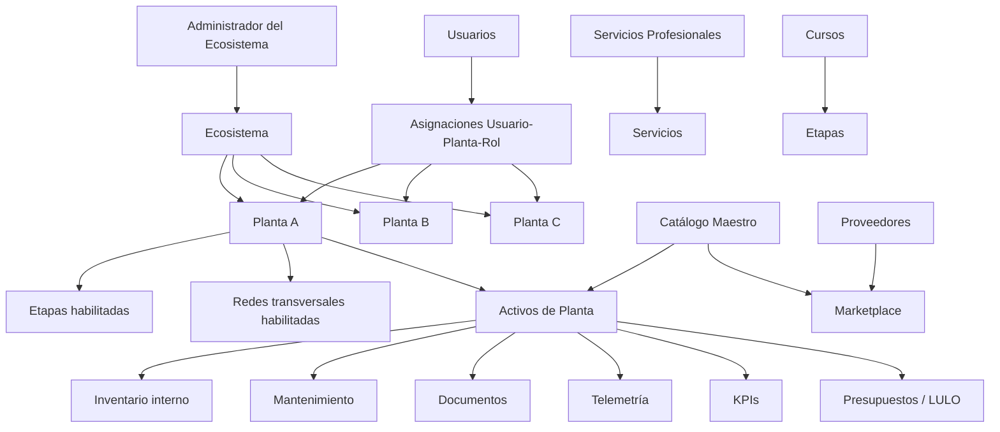
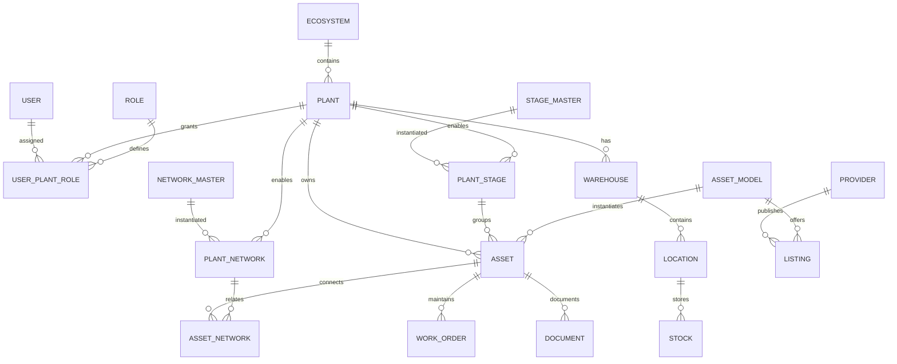

# Ecosistema Digital FUR — Arquitectura Técnica Integral

**Proyecto:** Ecosistema Digital para Planta de Beneficio de Oro  
**Versión del documento:** 1.0  
**Stack objetivo:** React.js + NestJS + PostgreSQL + Odoo 19 + IoT/PLC/SCADA  
**Arquitectura:** Modular, multi-planta, multi-rol, API-first, event-driven, observable y extensible  
**Idioma:** Español

---

## 1. Objetivo

Definir la arquitectura funcional y técnica del Ecosistema Digital FUR para administrar una o múltiples plantas de beneficio de oro, manteniendo una separación clara entre:

- catálogo maestro global;
- configuración y operación por planta;
- usuarios y permisos por planta;
- redes transversales habilitadas por planta;
- etapas de proceso habilitadas por planta;
- activos físicos realmente utilizados por cada planta;
- inventario propio de cada planta;
- activos/ofertas comerciales de proveedores;
- servicios profesionales;
- cursos;
- mantenimiento;
- documentos;
- presupuestos LULO/APU;
- telemetría industrial;
- dashboards por entidad y por rol.

La plataforma debe permitir que un **usuario común/consumidor** navegue por las plantas visibles en modo **solo lectura**, mientras que los usuarios internos disponen de permisos de escritura según **planta + rol + módulo + acción**.

---

# 2. Principios arquitectónicos

1. **Multi-planta real**  
   Un ecosistema puede contener múltiples plantas.

2. **Permisos por planta**  
   Un usuario puede administrar una planta, consultar otra y no tener acceso operativo a una tercera.

3. **Lectura pública o controlada**  
   Un usuario consumidor puede navegar plantas visibles sin capacidad de escritura.

4. **Catálogo ≠ activo físico de planta**  
   El catálogo define tipos/modelos posibles.  
   El activo de planta es una instancia física real.

5. **Marketplace ≠ inventario de planta**  
   Marketplace contiene ofertas de proveedores.  
   Inventario contiene bienes realmente controlados por la planta.

6. **Redes transversales configurables**  
   Existe un catálogo maestro de redes, pero cada planta habilita solo las que utiliza.

7. **Etapas configurables**  
   Existe un catálogo maestro de etapas, pero cada planta habilita solo las etapas que realmente forman parte de su proceso.

8. **FUR como identidad transversal**  
   Cada entidad relevante debe contar con una ficha única o identificador persistente.

9. **API-first**  
   Todo módulo funcional debe exponer APIs estables y versionadas.

10. **Auditoría por diseño**  
    Toda acción relevante debe dejar trazabilidad.

11. **Observabilidad integral**  
    Logs, métricas, trazas, eventos, salud de servicios y auditoría funcional.

12. **Integración OT/IT desacoplada**  
    PLC, SCADA, RTU, laboratorio e IoT se integran mediante gateways/eventos, evitando acoplar directamente el frontend con OT.

---

# 3. Modelo conceptual del ecosistema



---

# 4. Jerarquía funcional

```text
ECOSISTEMA
└── PLANTAS
    ├── Usuarios y roles por planta
    ├── Redes transversales habilitadas
    ├── Etapas habilitadas
    ├── Activos físicos
    │   ├── FUR
    │   ├── Estado
    │   ├── Documentos
    │   ├── Telemetría
    │   ├── Mantenimiento
    │   ├── Repuestos
    │   └── Costos
    ├── Inventario
    ├── Mantenimiento
    ├── Presupuesto
    ├── Documentos
    └── Dashboards
```

Entidades globales:

```text
CATÁLOGO MAESTRO
PROVEEDORES
MARKETPLACE
SERVICIOS PROFESIONALES
CURSOS
FAMILIAS DE ACTIVOS
TIPOS DE ACTIVOS
REDES TRANSVERSALES
ETAPAS MAESTRAS
```

---

# 5. Roles y modelo de acceso

## 5.1 Tipos de usuario

### Administrador del ecosistema
Puede:

- crear plantas;
- configurar catálogos globales;
- crear redes maestras;
- crear etapas maestras;
- administrar organizaciones;
- administrar roles globales;
- asignar usuarios a plantas;
- acceder a auditoría global.

### Administrador de planta
Puede operar exclusivamente sobre las plantas asignadas.

### Gerente de planta
Acceso a dashboards, operación, producción, indicadores y aprobaciones según política.

### Jefe de mantenimiento
Gestiona activos, órdenes, planes, fallas, inspecciones, repuestos y costos.

### Almacén / logística
Gestiona inventario, ubicaciones, entradas, salidas, reservas y transferencias.

### Compras
Gestiona requisiciones, RFQ, ofertas, proveedores, órdenes de compra y recepción documental.

### Presupuesto / costos
Gestiona LULO/APU, partidas, recursos, análisis, presupuestos y valorizaciones.

### Laboratorio / calidad
Gestiona muestras, ensayos, resultados, QA/QC y certificados.

### Operador de planta
Lectura y actualización de variables/estados autorizados.

### Técnico / instrumentista
Gestiona dispositivos, señales, diagnósticos e IoT según permisos.

### Instructor
Gestiona cursos, contenidos y evaluaciones.

### Proveedor
Gestiona productos, ofertas, precios, pedidos y documentación comercial propia.

### Servicio profesional / contratista
Gestiona perfil, servicios, disponibilidad, propuestas y documentación propia.

### Usuario común / consumidor
Puede navegar las plantas visibles y consultar información permitida, pero **sin escritura**.

---

# 6. Regla de autorización

La autorización no debe basarse únicamente en el usuario.

Debe evaluarse:

```text
USUARIO
+ PLANTA
+ ROL
+ MÓDULO
+ ACCIÓN
+ ALCANCE DE DATOS
```

Ejemplo:

```text
Carlos
Planta A
Rol: Administrador de Planta
Módulo: Activos
Acción: UPDATE
=> PERMITIDO
```

```text
Carlos
Planta B
Rol: Lector
Módulo: Activos
Acción: UPDATE
=> DENEGADO
```

---

# 7. Estrategia de base de datos PostgreSQL

Se recomienda un único clúster PostgreSQL con separación lógica por **schemas**.

## 7.1 Schemas propuestos

```text
iam
core
catalog
plant
process
asset
inventory
maintenance
procurement
marketplace
provider
professional
lms
budget
document
telemetry
analytics
audit
integration
```

---

# 8. Schema `iam`

Responsable de identidad, roles, permisos y relación usuario-planta.

## 8.1 `iam.users`

```sql
id                  uuid PK
email               varchar UNIQUE
username            varchar UNIQUE NULL
password_hash       text
first_name           varchar
last_name            varchar
status               varchar
is_global_admin      boolean DEFAULT false
last_login_at        timestamptz
created_at           timestamptz
updated_at           timestamptz
```

## 8.2 `iam.roles`

```sql
id                  uuid PK
code                varchar UNIQUE
name                varchar
scope               varchar -- GLOBAL | PLANT | EXTERNAL
description         text
created_at           timestamptz
```

## 8.3 `iam.permissions`

```sql
id                  uuid PK
resource            varchar
action              varchar
code                varchar UNIQUE
description         text
```

Ejemplos:

```text
asset.read
asset.create
asset.update
asset.delete
inventory.read
inventory.move
maintenance.work_order.create
budget.apu.edit
plant.network.configure
```

## 8.4 `iam.role_permissions`

```sql
role_id             uuid FK
permission_id       uuid FK
PRIMARY KEY(role_id, permission_id)
```

## 8.5 `iam.user_plant_roles`

Tabla crítica del modelo multi-planta.

```sql
id                  uuid PK
user_id             uuid FK iam.users
plant_id            uuid FK core.plants
role_id             uuid FK iam.roles
status              varchar
starts_at           timestamptz NULL
ends_at             timestamptz NULL
created_at           timestamptz
```

Un usuario puede tener más de un rol por planta.

## 8.6 `iam.user_plant_overrides`

Permisos excepcionales.

```sql
id                  uuid PK
user_id             uuid
plant_id            uuid
permission_id       uuid
effect              varchar -- ALLOW | DENY
```

---

# 9. Schema `core`

## 9.1 `core.ecosystems`

```sql
id                  uuid PK
code                varchar UNIQUE
name                varchar
description         text
status              varchar
created_at           timestamptz
updated_at           timestamptz
```

## 9.2 `core.plants`

```sql
id                  uuid PK
ecosystem_id        uuid FK
code                varchar
name                varchar
slug                varchar UNIQUE
description         text
country_code        varchar
timezone            varchar
status              varchar
visibility          varchar -- PUBLIC | AUTHENTICATED | PRIVATE
logo_url            text NULL
hero_image_url      text NULL
created_at           timestamptz
updated_at           timestamptz
```

## 9.3 `core.plant_settings`

```sql
plant_id            uuid PK
currency_code       varchar
locale              varchar
units_system        varchar
public_dashboard    boolean
public_assets       boolean
public_processes    boolean
public_documents    boolean
metadata            jsonb
```

---

# 10. Schema `catalog`

El catálogo es global y no representa posesión física.

## 10.1 `catalog.asset_families`

Ejemplos:

- bombas;
- molinos;
- motores;
- válvulas;
- tableros;
- hornos;
- espesadores;
- cribas;
- instrumentos;
- transformadores.

```sql
id                  uuid PK
code                varchar UNIQUE
name                varchar
parent_id           uuid NULL
description         text
icon                 varchar NULL
```

## 10.2 `catalog.asset_types`

```sql
id                  uuid PK
family_id           uuid FK
code                varchar UNIQUE
name                varchar
description         text
default_specs       jsonb
```

## 10.3 `catalog.asset_models`

```sql
id                  uuid PK
asset_type_id       uuid FK
manufacturer_id     uuid NULL
model_name          varchar
specifications      jsonb
technical_data      jsonb
datasheet_document_id uuid NULL
status              varchar
```

## 10.4 `catalog.manufacturers`

```sql
id                  uuid PK
name                varchar
country_code        varchar
website             text
```

---

# 11. Schema `process`

## 11.1 `process.stage_master`

Catálogo global de etapas.

```sql
id                  uuid PK
code                varchar UNIQUE -- D01, D02...
name                varchar
sequence_default    integer
description         text
stage_group          varchar
color_token         varchar
```

Etapas maestras recomendadas:

```text
D01 Recepción y Alimentación
D02 Trituración Primaria
D03 Cribado Primario
D04 Trituración Secundaria
D05 Transporte y Almacenamiento Intermedio
D06 Molienda Primaria
D07 Molienda Secundaria
D08 Clasificación
D09 Acondicionamiento / Pre-lixiviación
D10 Espesamiento Pre-lixiviación
D11 Lixiviación y Adsorción CIL
D12 Recuperación y Manejo de Carbón Cargado
D13 Lavado Ácido de Carbón
D14 Elución / Desorción
D15 Electrowinning
D16 Secado / Calcinación
D17 Fundición y Producto Doré
D18 Reactivación y Retorno de Carbón
D19 Espesamiento y Manejo de Relaves
D20 Disposición de Relaves / Colas
```

## 11.2 `process.plant_stages`

Define qué etapas existen en cada planta.

```sql
id                  uuid PK
plant_id            uuid FK
stage_master_id     uuid FK
sequence            integer
name_override       varchar NULL
is_enabled          boolean
is_public           boolean
configuration       jsonb
UNIQUE(plant_id, stage_master_id)
```

## 11.3 `process.stage_connections`

Permite representar flujo de proceso.

```sql
id                  uuid PK
plant_id            uuid
source_stage_id     uuid
target_stage_id     uuid
flow_type           varchar
is_return_flow      boolean
metadata            jsonb
```

---

# 12. Redes transversales

Las redes existen como catálogo maestro, pero **no todas las plantas usan todas**.

## 12.1 `plant.network_master`

```sql
id                  uuid PK
code                varchar UNIQUE
name                varchar
description         text
icon                 varchar
color_token         varchar
```

Redes actuales:

```text
FUR-PROC  Procesos
FUR-PTE   Potencia Eléctrica
FUR-IOT   IoT / Instrumentación
FUR-GPON  Comunicaciones
FUR-CC    Control de Calidad
FUR-LAB   Laboratorios
FUR-MNT   Mantenimiento
FUR-RQ    Requisiciones
FUR-OF    Ofertas Comerciales
FUR-CAM   Cámaras / Seguridad
```

## 12.2 `plant.plant_networks`

```sql
id                  uuid PK
plant_id            uuid FK
network_master_id   uuid FK
is_enabled          boolean
is_public           boolean
configuration       jsonb
UNIQUE(plant_id, network_master_id)
```

---

# 13. Schema `asset`

## 13.1 Diferencia fundamental

### Catálogo
Describe **qué tipo de activo existe**.

### Marketplace
Describe **qué producto vende un proveedor**.

### Activo físico
Describe **qué unidad física posee/usa una planta**.

---

## 13.2 `asset.assets`

```sql
id                  uuid PK
plant_id            uuid FK
plant_stage_id      uuid FK
asset_model_id      uuid FK catalog.asset_models
fur_code            varchar
tag                 varchar
name                varchar
serial_number       varchar NULL
manufacturer_id     uuid NULL
installation_date   date NULL
commission_date     date NULL
status              varchar
criticality         varchar
location_id         uuid NULL
parent_asset_id     uuid NULL
is_public           boolean
metadata            jsonb
created_at           timestamptz
updated_at           timestamptz
UNIQUE(plant_id, tag)
```

Estados sugeridos:

```text
OPERATIVE
MAINTENANCE
OUT_OF_SERVICE
CRITICAL
STANDBY
COMMISSIONING
STOCK
REPAIR
DECOMMISSIONED
```

## 13.3 `asset.asset_networks`

Un activo puede relacionarse con varias redes.

```sql
asset_id            uuid FK
plant_network_id    uuid FK
relation_type       varchar
PRIMARY KEY(asset_id, plant_network_id)
```

## 13.4 `asset.asset_components`

Jerarquía BOM física.

```sql
id                  uuid PK
parent_asset_id     uuid
child_asset_id      uuid NULL
catalog_item_id     uuid NULL
quantity            numeric
position_code       varchar
```

## 13.5 `asset.asset_status_history`

```sql
id                  uuid PK
asset_id            uuid
old_status          varchar
new_status          varchar
reason              text
changed_by          uuid
changed_at          timestamptz
```

---

# 14. FUR — Ficha Única de Registro

Cada activo debe exponer una ficha consolidada.

## 14.1 Datos mínimos

```text
Código / Tag
Planta
Etapa
Redes relacionadas
Familia
Tipo
Modelo
Fabricante
Serie
Ubicación
Estado
Criticidad
Capacidad
Potencia
Fecha de instalación
Horas de operación
Último mantenimiento
Próximo mantenimiento
Documentos
BOM / repuestos
Telemetría
Historial
Costos
KPIs
Observaciones
```

## 14.2 API de ficha consolidada

```http
GET /api/v1/plants/:plantId/assets/:assetId/fur
```

Respuesta:

```json
{
  "asset": {},
  "plant": {},
  "stage": {},
  "networks": [],
  "documents": [],
  "maintenance": {},
  "inventory": {},
  "telemetry": {},
  "kpis": [],
  "history": []
}
```

---

# 15. Schema `inventory`

El inventario de planta **no es inventario de proveedor**.

## 15.1 `inventory.warehouses`

```sql
id                  uuid PK
plant_id            uuid
code                varchar
name                varchar
status              varchar
```

## 15.2 `inventory.locations`

```sql
id                  uuid PK
warehouse_id        uuid
parent_id           uuid NULL
code                varchar
name                varchar
location_type       varchar
```

## 15.3 `inventory.items`

Representa ítems controlados internamente.

```sql
id                  uuid PK
plant_id            uuid
catalog_item_id     uuid NULL
asset_id            uuid NULL
sku                 varchar
name                varchar
item_type           varchar -- SPARE | CONSUMABLE | TOOL | ASSET
uom                 varchar
is_serialized       boolean
is_lot_controlled   boolean
```

## 15.4 `inventory.stock`

```sql
item_id             uuid
location_id         uuid
quantity_on_hand    numeric
quantity_reserved   numeric
quantity_available  numeric
```

## 15.5 `inventory.movements`

```sql
id                  uuid PK
plant_id            uuid
item_id             uuid
from_location_id    uuid NULL
to_location_id      uuid NULL
quantity            numeric
movement_type       varchar
reference_type      varchar
reference_id        uuid NULL
performed_by        uuid
performed_at        timestamptz
```

---

# 16. Schema `maintenance`

## 16.1 `maintenance.plans`

```sql
id                  uuid PK
plant_id            uuid
asset_id            uuid
plan_type           varchar -- PREVENTIVE | PREDICTIVE | CONDITION
name                varchar
frequency_value     numeric
frequency_unit      varchar
next_due_at         timestamptz
status              varchar
```

## 16.2 `maintenance.work_orders`

```sql
id                  uuid PK
plant_id            uuid
asset_id            uuid
code                varchar
type                varchar
priority            varchar
status              varchar
description         text
requested_by        uuid
assigned_to         uuid NULL
planned_start       timestamptz NULL
planned_end         timestamptz NULL
actual_start        timestamptz NULL
actual_end          timestamptz NULL
cost_total          numeric DEFAULT 0
```

## 16.3 `maintenance.failures`

```sql
id                  uuid PK
plant_id            uuid
asset_id            uuid
failure_code        varchar
failure_mode        varchar
description         text
detected_at         timestamptz
severity            varchar
root_cause          text NULL
```

## 16.4 `maintenance.inspections`

```sql
id                  uuid PK
plant_id            uuid
asset_id            uuid
template_id         uuid
status              varchar
performed_by        uuid
performed_at        timestamptz
result              jsonb
```

---

# 17. Requisiciones y compras

## 17.1 `procurement.requisitions`

```sql
id                  uuid PK
plant_id            uuid
code                varchar
requested_by        uuid
stage_id            uuid NULL
asset_id            uuid NULL
status              varchar
priority            varchar
needed_by           date NULL
justification       text
```

## 17.2 `procurement.requisition_lines`

```sql
id                  uuid PK
requisition_id      uuid
catalog_item_id     uuid NULL
description         text
quantity            numeric
uom                 varchar
estimated_price     numeric NULL
```

## 17.3 `procurement.rfqs`

```sql
id                  uuid PK
plant_id            uuid
requisition_id      uuid
code                varchar
status              varchar
deadline_at         timestamptz
```

## 17.4 `procurement.supplier_quotes`

```sql
id                  uuid PK
rfq_id              uuid
provider_id         uuid
currency            varchar
total_amount        numeric
delivery_days       integer
conditions          text
status              varchar
```

---

# 18. Schema `provider`

## 18.1 `provider.providers`

```sql
id                  uuid PK
organization_name   varchar
tax_id              varchar
country_code        varchar
status              varchar
rating              numeric NULL
verified             boolean
```

## 18.2 `provider.provider_stage_capabilities`

Filtrado por etapa.

```sql
provider_id         uuid
stage_master_id     uuid
PRIMARY KEY(provider_id, stage_master_id)
```

## 18.3 `provider.provider_asset_families`

```sql
provider_id         uuid
asset_family_id     uuid
PRIMARY KEY(provider_id, asset_family_id)
```

---

# 19. Schema `marketplace`

## 19.1 `marketplace.listings`

```sql
id                  uuid PK
provider_id         uuid
asset_model_id      uuid NULL
asset_family_id     uuid
title               varchar
description         text
price               numeric
currency            varchar
status              varchar
stock_text          varchar NULL
is_featured         boolean
created_at           timestamptz
```

## 19.2 `marketplace.listing_stages`

```sql
listing_id          uuid
stage_master_id     uuid
PRIMARY KEY(listing_id, stage_master_id)
```

Filtros:

```text
Etapa
Familia
Tipo
Fabricante
Precio
Proveedor
Disponibilidad
```

---

# 20. Servicios profesionales

## 20.1 `professional.contractors`

```sql
id                  uuid PK
organization_name   varchar
description         text
verified             boolean
rating               numeric NULL
status               varchar
```

## 20.2 `professional.services`

```sql
id                  uuid PK
contractor_id       uuid
name                varchar
description         text
service_type        varchar
```

## 20.3 `professional.service_stages`

```sql
service_id          uuid
stage_master_id     uuid
PRIMARY KEY(service_id, stage_master_id)
```

---

# 21. LMS / Cursos

## 21.1 `lms.courses`

```sql
id                  uuid PK
title               varchar
description         text
provider_type       varchar
provider_id         uuid NULL
status              varchar
duration_minutes    integer NULL
```

## 21.2 `lms.course_stages`

```sql
course_id           uuid
stage_master_id     uuid
PRIMARY KEY(course_id, stage_master_id)
```

## 21.3 `lms.enrollments`

```sql
id                  uuid PK
course_id           uuid
user_id             uuid
plant_id            uuid NULL
status              varchar
progress_percent    numeric
completed_at        timestamptz NULL
```

---

# 22. Documentos

## 22.1 `document.documents`

```sql
id                  uuid PK
plant_id            uuid NULL
title               varchar
document_type       varchar
mime_type           varchar
storage_key         text
version             integer
status              varchar
visibility          varchar
uploaded_by         uuid
created_at           timestamptz
```

## 22.2 Relaciones documentales

```text
document.asset_documents
document.stage_documents
document.process_documents
document.network_documents
document.provider_documents
document.course_documents
document.budget_documents
```

Ejemplo:

```sql
CREATE TABLE document.asset_documents (
    document_id uuid,
    asset_id uuid,
    relation_type varchar,
    PRIMARY KEY(document_id, asset_id)
);
```

Debe soportar:

- preview PDF;
- imágenes;
- Word;
- Excel;
- planos;
- manuales;
- procedimientos;
- SOP;
- versiones;
- permisos;
- auditoría.

---

# 23. Telemetría e IoT

## 23.1 `telemetry.devices`

```sql
id                  uuid PK
plant_id            uuid
asset_id            uuid NULL
protocol            varchar
gateway_id          uuid NULL
name                varchar
status              varchar
metadata            jsonb
```

## 23.2 `telemetry.tags`

```sql
id                  uuid PK
device_id           uuid
tag_name            varchar
display_name        varchar
data_type           varchar
unit                varchar
sampling_mode       varchar
```

## 23.3 Datos de series de tiempo

Para volumen moderado:

```sql
telemetry.measurements
```

```sql
time                timestamptz
plant_id            uuid
tag_id              uuid
value_numeric       double precision NULL
value_text          text NULL
quality             smallint
```

Recomendación:

- PostgreSQL + TimescaleDB si el volumen lo justifica.
- Particionado temporal.
- Retención por política.
- Agregados de 1 min, 5 min, 1 h, 1 día.

---

# 24. Presupuesto / Motor LULO

Este módulo debe mantenerse desacoplado porque su dominio es considerablemente más complejo.

## 24.1 Entidades mínimas

```text
budget.projects
budget.budgets
budget.chapters
budget.items
budget.apus
budget.apu_resources
budget.resources
budget.materials
budget.labor
budget.equipment
budget.transport
budget.indirect_costs
budget.price_books
budget.price_history
budget.measurements
budget.valuations
budget.scenarios
budget.adjustments
```

## 24.2 `budget.apus`

```sql
id                  uuid PK
plant_id            uuid
code                varchar
name                varchar
unit                varchar
yield_value         numeric
direct_cost         numeric
indirect_cost       numeric
unit_price          numeric
metadata            jsonb
```

## 24.3 `budget.apu_resources`

```sql
id                  uuid PK
apu_id              uuid
resource_id         uuid
resource_type       varchar
quantity            numeric
unit_price          numeric
waste_factor        numeric
subtotal            numeric
```

El motor debe soportar:

- rendimientos;
- cuadrillas;
- desperdicios;
- costos directos;
- costos indirectos;
- equipos;
- materiales;
- mano de obra;
- transporte;
- monedas;
- impuestos;
- escenarios;
- análisis de sensibilidad;
- histórico de precios;
- valorizaciones.

---

# 25. Auditoría

## 25.1 `audit.events`

```sql
id                  uuid PK
occurred_at         timestamptz
user_id             uuid NULL
plant_id            uuid NULL
module              varchar
entity_type         varchar
entity_id           uuid NULL
action              varchar
old_data            jsonb NULL
new_data            jsonb NULL
ip_address          inet NULL
user_agent          text NULL
correlation_id      uuid
```

Nunca eliminar físicamente eventos de auditoría salvo política regulatoria explícita.

---

# 26. Row-Level Security (RLS)

Se recomienda habilitar RLS en tablas sensibles con `plant_id`.

Ejemplo conceptual:

```sql
ALTER TABLE asset.assets ENABLE ROW LEVEL SECURITY;
```

Política:

```sql
CREATE POLICY plant_read_policy
ON asset.assets
FOR SELECT
USING (
    plant_id = ANY(current_setting('app.allowed_plants')::uuid[])
);
```

La autorización principal sigue estando en NestJS, pero RLS aporta una segunda barrera.

---

# 27. Índices críticos

Ejemplos:

```sql
CREATE INDEX idx_assets_plant_stage
ON asset.assets(plant_id, plant_stage_id);

CREATE INDEX idx_assets_plant_status
ON asset.assets(plant_id, status);

CREATE INDEX idx_work_orders_plant_status
ON maintenance.work_orders(plant_id, status);

CREATE INDEX idx_inventory_stock_location
ON inventory.stock(location_id, item_id);

CREATE INDEX idx_marketplace_family_price
ON marketplace.listings(asset_family_id, price);

CREATE INDEX idx_audit_plant_time
ON audit.events(plant_id, occurred_at DESC);
```

Además:

- GIN para JSONB;
- trigram para búsqueda textual;
- índices parciales para registros activos;
- índices por `created_at` en históricos.

---

# 28. Backend NestJS

## 28.1 Estructura sugerida

```text
apps/
  api/
src/
  modules/
    iam/
    plants/
    catalog/
    processes/
    networks/
    assets/
    inventory/
    maintenance/
    procurement/
    marketplace/
    providers/
    professionals/
    lms/
    documents/
    budgets/
    telemetry/
    dashboards/
    audit/
    integrations/
  common/
    auth/
    guards/
    decorators/
    filters/
    interceptors/
    pipes/
    events/
    logging/
    database/
```

## 28.2 Arquitectura interna por módulo

```text
assets/
  application/
    commands/
    queries/
    services/
    dto/
  domain/
    entities/
    value-objects/
    repositories/
    events/
  infrastructure/
    persistence/
    controllers/
    mappers/
```

---

# 29. REST API

Base:

```text
/api/v1
```

## 29.1 Plantas

```http
GET    /plants
POST   /plants
GET    /plants/:plantId
PATCH  /plants/:plantId
GET    /plants/:plantId/dashboard
```

## 29.2 Etapas

```http
GET    /stages/catalog
GET    /plants/:plantId/stages
POST   /plants/:plantId/stages
PATCH  /plants/:plantId/stages/:stageId
```

## 29.3 Redes

```http
GET    /networks/catalog
GET    /plants/:plantId/networks
POST   /plants/:plantId/networks
DELETE /plants/:plantId/networks/:networkId
```

## 29.4 Activos

```http
GET    /catalog/assets
GET    /plants/:plantId/assets
POST   /plants/:plantId/assets
GET    /plants/:plantId/assets/:assetId
PATCH  /plants/:plantId/assets/:assetId
GET    /plants/:plantId/assets/:assetId/fur
```

Filtros:

```text
stage
network
family
type
status
criticality
location
search
```

## 29.5 Marketplace

```http
GET /marketplace/listings
GET /marketplace/listings/:id
```

Filtros:

```text
stage
family
type
provider
price_min
price_max
```

## 29.6 Proveedores

```http
GET /providers
GET /providers/:id
```

Filtros:

```text
stage
family
```

## 29.7 Servicios

```http
GET /professional-services
```

Filtro principal:

```text
stage
```

## 29.8 Cursos

```http
GET /courses
```

Filtro:

```text
stage
```

---

# 30. Eventos de dominio

Ejemplos:

```text
plant.created
plant.stage.enabled
plant.network.enabled
asset.created
asset.status.changed
asset.assigned_to_stage
inventory.stock.changed
maintenance.work_order.created
maintenance.work_order.closed
procurement.requisition.created
procurement.rfq.published
marketplace.listing.created
telemetry.alarm.triggered
document.version.created
budget.apu.updated
```

Los eventos pueden distribuirse vía:

- Redis Streams;
- RabbitMQ;
- NATS;
- Kafka si la escala futura lo exige.

---

# 31. Frontend React

## 31.1 Stack sugerido

```text
React
TypeScript
Vite
React Router
TanStack Query
Zustand o Redux Toolkit
React Hook Form
Zod
Tailwind CSS o CSS Modules
ECharts / Recharts para dashboards
```

---

# 32. Contexto global de planta

El frontend debe mantener:

```ts
type PlantContext = {
  currentPlantId: string | null;
  availablePlants: PlantSummary[];
  permissions: string[];
  roleCodes: string[];
}
```

Cambiar de planta debe invalidar/recargar:

- activos;
- etapas;
- redes;
- mantenimiento;
- inventario;
- dashboards;
- documentos;
- presupuesto;
- KPIs.

---

# 33. Navegación principal

```text
Todo el ecosistema
Catálogo
Activos Físicos
Procesos
Marketplace
Proveedores
Servicios Profesionales
Cursos (LMS)
Redes Transversales
Mantenimiento
WMS / Inventario
Presupuestos (LULO)
Documentos
Dashboards
```

---

# 34. Comportamiento por sección

## Catálogo

Fuente: global.

Debe mostrar todos los tipos/modelos de activos.

Filtros:

```text
Red transversal
Etapa
Familia
Tipo
Fabricante
```

---

## Activos Físicos

Fuente: planta actual.

Solo los activos realmente usados/registrados por la planta.

Filtros:

```text
Etapa
Red
Familia
Tipo
Estado
Criticidad
Ubicación
```

---

## Procesos

Fuente: planta actual.

Solo etapas y activos de proceso habilitados.

Vista recomendada:

```text
Mapa de proceso
Lista de etapas
Activos por etapa
Estado
Variables
Alarmas
Producción
```

---

## Marketplace

Fuente: proveedores.

Muestra productos/ofertas comerciales.

Filtros:

```text
Etapa
Familia
Tipo
Proveedor
Precio
Marca
```

---

## Proveedores

Filtros:

```text
Etapa
Familia
País
Certificación
Rating
```

---

## Servicios Profesionales

Filtros:

```text
Etapa
Especialidad
Ubicación
Certificación
Disponibilidad
```

---

## Cursos

Filtros:

```text
Etapa
Nivel
Proveedor
Duración
Certificación
```

---

## Redes Transversales

Fuente: planta actual.

Mostrar únicamente redes habilitadas.

Cada red debe contar con su dashboard propio.

---

## Mantenimiento

Fuente: planta actual.

Debe cubrir:

```text
Órdenes de trabajo
Solicitudes
Requisiciones
Planes
Inspecciones
Fallas
Backlog
Costos
Repuestos
KPIs
```

---

## WMS / Inventario

Fuente: planta actual.

Estados:

```text
Instalado / operativo
En stock
En reparación
Reservado
En tránsito
Baja
```

No mezclar con stock de proveedores.

---

## Presupuestos LULO

Fuente: planta/proyecto.

Submódulos:

```text
Proyectos
Presupuestos
Capítulos
Partidas
APU
Recursos
Precios
Escenarios
Valuaciones
Reportes
```

---

## Documentos

Debe permitir:

```text
Preview
Versiones
Relacionar a activo
Relacionar a etapa
Relacionar a red
Relacionar a proceso
Permisos
Búsqueda
Auditoría
```

---

# 35. Dashboards por entidad

Cada entidad importante debe tener un dashboard de gestión.

## 35.1 Dashboard Administrador del Ecosistema

```text
Plantas
Usuarios
Roles
Permisos
Catálogos
Redes maestras
Etapas maestras
Integraciones
Auditoría
Salud del sistema
```

## 35.2 Dashboard Administrador de Planta

```text
Resumen operacional
Activos
Disponibilidad
Etapas
Redes
Mantenimiento
Inventario
Requisiciones
Documentos
Usuarios de planta
Alertas
KPIs
```

## 35.3 Dashboard Proveedor

```text
Productos
Marketplace
Precios
Stock comercial
Cotizaciones
RFQ
Pedidos
Documentación
Métricas comerciales
```

## 35.4 Dashboard Contratista

```text
Servicios
Etapas atendidas
Disponibilidad
Solicitudes
Propuestas
Contratos
Documentación
Calificaciones
```

## 35.5 Dashboard Mantenimiento

```text
Backlog
OT abiertas
OT vencidas
Preventivo
Predictivo
Correctivo
Disponibilidad
MTBF
MTTR
Costos
Repuestos críticos
```

## 35.6 Dashboard Inventario

```text
Stock actual
Mínimos
Máximos
Rotación
Reservas
Movimientos
Repuestos críticos
Inventario por almacén
Activos en reparación
```

## 35.7 Dashboard Presupuesto

```text
Presupuestos
APU
Costo directo
Costo indirecto
Desviaciones
Escenarios
Avance
Valuaciones
Historial de precios
```

## 35.8 Dashboard Usuario común

Solo lectura.

```text
Plantas visibles
Mapa general
Procesos públicos
Activos públicos
Indicadores públicos
Marketplace
Proveedores
Servicios
Cursos
Documentación pública
```

---

# 36. Rutas frontend sugeridas

```text
/
 /catalog
 /plants
 /plants/:plantSlug
 /plants/:plantSlug/dashboard
 /plants/:plantSlug/processes
 /plants/:plantSlug/stages/:stageCode
 /plants/:plantSlug/assets
 /plants/:plantSlug/assets/:assetId
 /plants/:plantSlug/networks
 /plants/:plantSlug/networks/:networkCode
 /plants/:plantSlug/maintenance
 /plants/:plantSlug/inventory
 /plants/:plantSlug/budgets
 /plants/:plantSlug/documents

 /marketplace
 /marketplace/:listingId

 /providers
 /providers/:providerId

 /professionals
 /professionals/:id

 /courses
 /courses/:courseId

 /admin
 /admin/plants
 /admin/users
 /admin/roles
 /admin/catalog
```

---

# 37. Componentes frontend reutilizables

```text
PlantSelector
PlantContextGuard
PermissionGate
RoleGate
StageFilter
NetworkFilter
AssetFamilyFilter
AssetStatusBadge
FurCard
AssetCard
ProcessStageCard
NetworkCard
KpiCard
DashboardGrid
DataTable
SearchBar
DocumentPreview
Timeline
AuditViewer
TelemetryChart
WorkOrderBoard
InventoryStockCard
BudgetApuEditor
MarketplaceListingCard
ProviderCard
ServiceCard
CourseCard
```

---

# 38. Sistema visual

Basado en el diseño actual.

## Paleta principal sugerida

```css
--fur-navy-950: #061A36;
--fur-navy-900: #08254C;
--fur-navy-800: #103866;

--fur-gold-500: #F5A800;
--fur-gold-400: #FDBA2D;

--fur-orange-500: #E87912;
--fur-blue-500: #2563B8;
--fur-cyan-500: #2896D2;
--fur-green-500: #1F9D55;
--fur-purple-500: #7445C6;
--fur-red-500: #D74646;
--fur-teal-500: #1B9C95;

--fur-gray-50: #F7F9FC;
--fur-gray-100: #EEF2F6;
--fur-gray-300: #CBD5E1;
--fur-gray-600: #58677A;
--fur-white: #FFFFFF;
```

Uso:

```text
Navy: navegación, encabezados, identidad
Gold: CTA y selección
Colores de red: diferenciación semántica
Grises: superficies y paneles
```

---

# 39. Búsqueda global

La barra principal debe buscar sobre:

```text
Activos
Procesos
Etapas
Documentos
Proveedores
Servicios
Cursos
Marketplace
FUR
Tags
```

Se recomienda PostgreSQL FTS inicialmente.

Más adelante:

```text
OpenSearch / Elasticsearch
```

si el volumen lo exige.

---

# 40. Seguridad

## Autenticación

```text
JWT access token
Refresh token rotativo
OAuth2/OIDC opcional
MFA para roles privilegiados
Service Accounts para integraciones
```

## Requisitos

```text
TLS 1.2+
RBAC
Permisos por planta
RLS
Rate limiting
CSP
CSRF si aplica
Hash Argon2id
Rotación de secretos
Vault/KMS
Auditoría inmutable
Segregación OT/IT
```

---

# 41. Integración con Odoo 19

Odoo debe actuar como ERP, no como base central de verdad para todo el ecosistema.

Dominios adecuados:

```text
Ventas
Compras
Contabilidad
Inventario ERP
Proyectos
RRHH
Fabricación
eLearning
Documentos
```

El Ecosistema FUR conserva su propio dominio para:

```text
Activos técnicos
FUR
Etapas
Redes
Telemetría
Mapa industrial
Relaciones OT
Contexto multi-planta
```

Integración:

```text
REST / JSON-RPC
Webhooks
Eventos
Jobs asíncronos
```

---

# 42. Integración OT / PLC / SCADA

```text
PLC/RTU
  ↓
Gateway industrial
  ↓
OPC UA / Modbus / MQTT
  ↓
Servicio de ingesta
  ↓
Validación + normalización
  ↓
Event Bus
  ↓
PostgreSQL/Timescale
  ↓
WebSocket/SSE
  ↓
Dashboard React
```

Nunca conectar el navegador directamente a PLC/SCADA.

---

# 43. Observabilidad

## Logs

JSON estructurado.

Campos:

```text
timestamp
service
environment
level
correlation_id
user_id
plant_id
module
message
```

## Métricas

```text
Prometheus
Grafana
```

## Trazas

```text
OpenTelemetry
```

## Alertas

```text
Alertmanager
```

---

# 44. Estrategia de cache

Redis para:

```text
sesiones
permisos
catálogos
plant settings
dashboards agregados
rate limiting
colas livianas
```

No usar cache como fuente de verdad.

---

# 45. Archivos y documentos

Almacenamiento de objetos:

```text
S3 compatible
MinIO en despliegues privados
```

Base de datos guarda:

```text
metadata
version
storage_key
checksum
permissions
relaciones
```

No guardar grandes binarios directamente en PostgreSQL salvo necesidad excepcional.

---

# 46. Convenciones

## UUID

UUID v7 recomendado para nuevas entidades.

## Fechas

Siempre UTC en backend.

Frontend convierte a timezone de planta.

## Dinero

```text
numeric(18,4)
currency_code ISO 4217
```

Nunca `float`.

## Unidades

Guardar:

```text
value
unit
```

Usar catálogo de unidades.

---

# 47. Reglas de integridad

1. Un activo de planta siempre pertenece a una planta.
2. Un activo puede pertenecer a una etapa habilitada de esa misma planta.
3. Un activo no puede relacionarse con una red no habilitada en la planta.
4. Un inventario interno siempre pertenece a una planta.
5. Una oferta Marketplace pertenece a un proveedor, no a una planta.
6. Un usuario no obtiene permisos de escritura solo por poder visualizar una planta.
7. Los documentos privados deben validar planta y permisos.
8. Todo cambio crítico debe auditarse.
9. Los eventos OT deben conservar calidad de dato y timestamp de origen.
10. Los registros históricos no deben sobrescribirse sin versionado.

---

# 48. MVP recomendado

## Fase 1 — Fundación

```text
IAM
Plantas
Usuarios
Roles
Permisos
Catálogo
Etapas
Redes
Activos
FUR
Documentos
```

## Fase 2 — Operación

```text
Procesos
Mantenimiento
Inventario
Requisiciones
Proveedores
Marketplace
Servicios
```

## Fase 3 — Datos

```text
IoT
SCADA
Telemetría
Dashboards
Alarmas
KPIs
Laboratorio
```

## Fase 4 — Presupuesto e integración

```text
LULO/APU
Odoo 19
Compras
Valuaciones
BI
Integraciones avanzadas
```

---

# 49. Estructura de repositorio sugerida

```text
ecosistema-fur/
├── apps/
│   ├── web/
│   ├── api/
│   ├── worker/
│   └── telemetry-ingest/
├── packages/
│   ├── ui/
│   ├── types/
│   ├── auth/
│   ├── validation/
│   └── config/
├── database/
│   ├── migrations/
│   ├── seeds/
│   └── views/
├── infra/
│   ├── docker/
│   ├── kubernetes/
│   ├── terraform/
│   └── monitoring/
└── docs/
    ├── architecture/
    ├── api/
    ├── database/
    └── adr/
```

---

# 50. Decisiones arquitectónicas clave

## ADR-001 — Multi-planta

Los permisos son por relación usuario-planta, no por usuario global.

## ADR-002 — Catálogo separado de activos

El catálogo describe modelos/tipos.  
`asset.assets` representa unidades físicas de planta.

## ADR-003 — Marketplace separado de inventario

No reutilizar las mismas tablas para ambos dominios.

## ADR-004 — Redes configurables

Las redes se definen globalmente y se habilitan por planta.

## ADR-005 — Etapas configurables

Las etapas se definen globalmente y se habilitan por planta.

## ADR-006 — Usuario consumidor

Puede navegar plantas visibles con permisos read-only.

## ADR-007 — Dashboard por entidad

Toda entidad operativa principal debe disponer de una experiencia de gestión propia.

## ADR-008 — OT desacoplado

Toda integración industrial pasa por una capa de ingesta/gateway.

---

# 51. Vista resumida de relaciones



---

# 52. Conclusión técnica

El sistema debe concebirse como un **ecosistema multi-planta basado en dominios**, no como una aplicación monolítica centrada en una única planta.

La separación fundamental es:

```text
Catálogo global
        ↓
Configuración por planta
        ↓
Etapas + Redes
        ↓
Activos físicos
        ↓
Operación / Inventario / Mantenimiento / Documentos / Datos
```

En paralelo:

```text
Proveedor → Marketplace
Contratista → Servicios
Instructor → Cursos
Odoo → ERP
OT → Telemetría
LULO → Presupuesto
```

El modelo de seguridad central es:

```text
Usuario + Planta + Rol + Permiso + Acción
```

El usuario consumidor puede navegar entre plantas visibles en modo **read-only**.

Los usuarios internos obtienen escritura únicamente cuando poseen una asignación válida de rol y permisos para la planta seleccionada.

Esta arquitectura permite escalar desde una sola planta hasta un ecosistema con múltiples plantas, organizaciones, proveedores, contratistas y fuentes OT, manteniendo trazabilidad, seguridad y separación clara de responsabilidades.
