# Diagrama entidad-relación (nombres de Odoo)

Generado el 2026-10-08 desde las claves foráneas reales (146 relaciones entre 74 tablas). Cada entidad lleva el nombre de su vista en el esquema `odoo`; la equivalencia con la tabla real está en `odoo._mapa_tablas`. Se regenera con `npm run db:er`.

## Vista general

```mermaid
erDiagram
  product_product ||--o{ x_product_network_rel : "asset_id"
  x_company_network ||--o{ x_product_network_rel : "plant_network_id"
  product_product ||--o{ mail_tracking_value : "asset_id"
  res_users |o--o{ mail_tracking_value : "changed_by"
  product_template ||--o{ product_product : "asset_model_id"
  x_product_manufacturer |o--o{ product_product : "manufacturer_id"
  res_company ||--o{ product_product : "plant_id"
  mrp_routing_workcenter |o--o{ product_product : "plant_stage_id"
  mrp_bom ||--o{ mrp_bom_line : "apu_id"
  x_budget_resource ||--o{ mrp_bom_line : "resource_id"
  res_company ||--o{ mrp_bom : "plant_id"
  project_project ||--o{ crossovered_budget : "project_id"
  res_company ||--o{ crossovered_budget : "plant_id"
  res_users |o--o{ crossovered_budget : "approved_by"
  res_users |o--o{ crossovered_budget : "created_by"
  crossovered_budget ||--o{ account_budget_post : "budget_id"
  res_company ||--o{ res_currency_rate : "plant_id"
  mrp_bom ||--o{ crossovered_budget_lines : "apu_id"
  crossovered_budget ||--o{ crossovered_budget_lines : "budget_id"
  account_budget_post ||--o{ crossovered_budget_lines : "chapter_id"
  x_budget_resource ||--o{ product_price_history : "resource_id"
  res_users |o--o{ product_price_history : "changed_by"
  res_company ||--o{ project_project : "plant_id"
  res_company ||--o{ x_budget_resource : "plant_id"
  x_stock_item |o--o{ x_budget_resource : "source_item_id"
  crossovered_budget ||--o{ x_budget_scenario : "budget_id"
  res_users |o--o{ x_budget_scenario : "created_by"
  crossovered_budget_lines ||--o{ account_move_line : "item_id"
  account_move ||--o{ account_move_line : "valuation_id"
  crossovered_budget ||--o{ account_move : "budget_id"
  res_users |o--o{ account_move : "approved_by"
  res_users |o--o{ account_move : "created_by"
  x_product_type ||--o{ product_template : "asset_type_id"
  x_product_manufacturer |o--o{ product_template : "manufacturer_id"
  x_product_type ||--o{ x_product_type_network : "asset_type_id"
  x_network ||--o{ x_product_type_network : "network_master_id"
  x_product_type ||--o{ x_product_type_stage : "asset_type_id"
  mrp_workcenter ||--o{ x_product_type_stage : "stage_master_id"
  product_category ||--o{ x_product_type : "family_id"
  res_company ||--o{ ir_sequence : "plant_id"
  res_company ||--o{ res_config_settings : "plant_id"
  x_ecosystem ||--o{ res_company : "ecosystem_id"
  product_product ||--o{ x_product_document : "asset_id"
  documents_document ||--o{ x_product_document : "document_id"
  documents_document ||--o{ ir_attachment : "document_id"
  res_users |o--o{ ir_attachment : "uploaded_by"
  res_company ||--o{ documents_document : "plant_id"
  res_users |o--o{ documents_document : "created_by"
  documents_document ||--o{ x_stage_document : "document_id"
  mrp_routing_workcenter ||--o{ x_stage_document : "plant_stage_id"
  res_company ||--o{ x_res_users_access_request : "plant_id"
  res_users |o--o{ x_res_users_access_request : "decided_by"
  res_users ||--o{ x_res_users_access_request : "user_id"
  res_users ||--o{ res_users_apikeys : "user_id"
  ir_model_access ||--o{ x_ir_model_access_group_rel : "permission_id"
  res_groups ||--o{ x_ir_model_access_group_rel : "role_id"
  res_company ||--o{ ir_rule : "plant_id"
  ir_model_access ||--o{ ir_rule : "permission_id"
  res_users ||--o{ ir_rule : "user_id"
  res_company ||--o{ res_groups_users_rel : "plant_id"
  res_groups ||--o{ res_groups_users_rel : "role_id"
  res_users ||--o{ res_groups_users_rel : "user_id"
  product_template |o--o{ x_stock_item : "catalog_item_id"
  res_company ||--o{ x_stock_item : "plant_id"
  res_company ||--o{ stock_location : "plant_id"
  stock_warehouse ||--o{ stock_location : "warehouse_id"
  res_company ||--o{ stock_move : "plant_id"
  res_users |o--o{ stock_move : "performed_by"
  x_stock_item ||--o{ stock_move : "item_id"
  stock_location |o--o{ stock_move : "from_location_id"
  stock_location |o--o{ stock_move : "to_location_id"
  x_stock_item ||--o{ stock_quant : "item_id"
  stock_location ||--o{ stock_quant : "location_id"
  res_company ||--o{ stock_warehouse : "plant_id"
  slide_channel ||--o{ x_slide_channel_stage : "course_id"
  mrp_workcenter ||--o{ x_slide_channel_stage : "stage_master_id"
  res_users |o--o{ slide_channel : "created_by"
  x_res_partner_contractor |o--o{ slide_channel : "contractor_id"
  res_partner |o--o{ slide_channel : "provider_id"
  res_company |o--o{ slide_channel_partner : "plant_id"
  res_users ||--o{ slide_channel_partner : "user_id"
  slide_channel ||--o{ slide_channel_partner : "course_id"
  slide_channel_partner ||--o{ slide_slide_partner : "enrollment_id"
  slide_slide ||--o{ slide_slide_partner : "lesson_id"
  slide_channel ||--o{ slide_slide : "course_id"
  product_product ||--o{ maintenance_plan : "asset_id"
  res_company ||--o{ maintenance_plan : "plant_id"
  res_users |o--o{ maintenance_plan : "created_by"
  x_budget_resource |o--o{ x_maintenance_request_cost : "resource_id"
  res_users |o--o{ x_maintenance_request_cost : "created_by"
  maintenance_request ||--o{ x_maintenance_request_cost : "work_order_id"
  res_users |o--o{ x_maintenance_request_history : "changed_by"
  maintenance_request ||--o{ x_maintenance_request_history : "work_order_id"
  res_users |o--o{ x_maintenance_request_part : "created_by"
  x_stock_item ||--o{ x_maintenance_request_part : "item_id"
  stock_location |o--o{ x_maintenance_request_part : "location_id"
  maintenance_request ||--o{ x_maintenance_request_part : "work_order_id"
  product_product ||--o{ maintenance_request : "asset_id"
  res_company ||--o{ maintenance_request : "plant_id"
  res_users |o--o{ maintenance_request : "assigned_to"
  res_users |o--o{ maintenance_request : "closed_by"
  res_users |o--o{ maintenance_request : "requested_by"
  maintenance_plan |o--o{ maintenance_request : "plan_id"
  product_supplierinfo ||--o{ x_product_supplierinfo_stage : "listing_id"
  mrp_workcenter ||--o{ x_product_supplierinfo_stage : "stage_master_id"
  product_category ||--o{ product_supplierinfo : "asset_family_id"
  product_template |o--o{ product_supplierinfo : "asset_model_id"
  res_partner ||--o{ product_supplierinfo : "provider_id"
  res_company ||--o{ x_company_network : "plant_id"
  x_network ||--o{ x_company_network : "network_master_id"
  res_company ||--o{ mrp_routing_workcenter : "plant_id"
  mrp_workcenter ||--o{ mrp_routing_workcenter : "stage_master_id"
  res_company ||--o{ x_mrp_routing_flow : "plant_id"
  mrp_routing_workcenter ||--o{ x_mrp_routing_flow : "source_stage_id"
  mrp_routing_workcenter ||--o{ x_mrp_routing_flow : "target_stage_id"
  res_users |o--o{ x_purchase_requisition_history : "changed_by"
  purchase_requisition ||--o{ x_purchase_requisition_history : "requisition_id"
  x_stock_item |o--o{ purchase_requisition_line : "item_id"
  purchase_requisition ||--o{ purchase_requisition_line : "requisition_id"
  product_product |o--o{ purchase_requisition : "asset_id"
  res_company ||--o{ purchase_requisition : "plant_id"
  res_users |o--o{ purchase_requisition : "approved_by"
  res_users |o--o{ purchase_requisition : "requested_by"
  maintenance_request |o--o{ purchase_requisition : "work_order_id"
  mrp_routing_workcenter |o--o{ purchase_requisition : "stage_id"
  purchase_order ||--o{ x_purchase_order_invitation : "rfq_id"
  res_partner ||--o{ x_purchase_order_invitation : "provider_id"
  res_company ||--o{ purchase_order : "plant_id"
  res_users |o--o{ purchase_order : "created_by"
  purchase_requisition ||--o{ purchase_order : "requisition_id"
  res_users |o--o{ purchase_order_line : "submitted_by"
  purchase_order ||--o{ purchase_order_line : "rfq_id"
  res_partner ||--o{ purchase_order_line : "provider_id"
  res_users ||--o{ x_res_partner_contractor_member : "user_id"
  x_res_partner_contractor ||--o{ x_res_partner_contractor_member : "contractor_id"
  res_users |o--o{ x_res_partner_contractor : "created_by"
  mrp_workcenter ||--o{ x_professional_service_stage : "stage_master_id"
  x_professional_service ||--o{ x_professional_service_stage : "service_id"
  x_res_partner_contractor ||--o{ x_professional_service : "contractor_id"
  product_category ||--o{ res_partner_res_partner_category_rel : "asset_family_id"
  res_partner ||--o{ res_partner_res_partner_category_rel : "provider_id"
  res_users ||--o{ x_res_partner_member : "user_id"
  res_partner ||--o{ x_res_partner_member : "provider_id"
  mrp_workcenter ||--o{ x_res_partner_stage : "stage_master_id"
  res_partner ||--o{ x_res_partner_stage : "provider_id"
  res_users |o--o{ res_partner : "created_by"
```

## Productos (catálogo, activos físicos y marketplace)

11 tablas · 26 relaciones que las tocan. Las entidades sin columnas pertenecen a otro grupo.

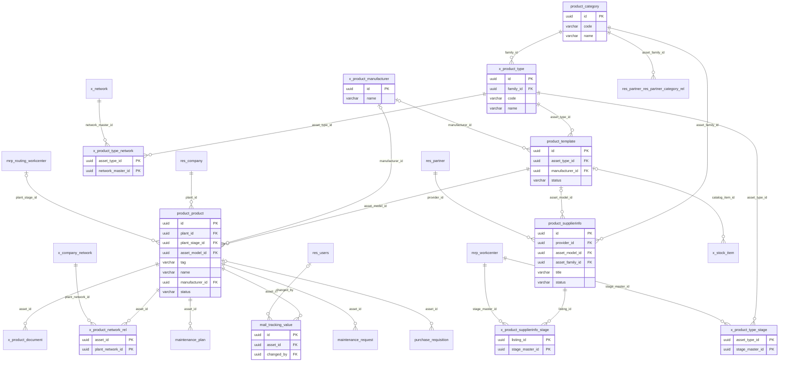

## Empresas, usuarios y permisos

13 tablas · 62 relaciones que las tocan. Las entidades sin columnas pertenecen a otro grupo.

```mermaid
erDiagram
  auditlog_log {
    uuid id PK
  }
  ir_model_access {
    uuid id PK
    varchar code
  }
  ir_rule {
    uuid id PK
    uuid user_id FK
    uuid plant_id FK
    uuid permission_id FK
  }
  ir_sequence {
    uuid plant_id PK
    varchar kind PK
    int year PK
  }
  res_company {
    uuid id PK
    uuid ecosystem_id FK
    varchar code
    varchar name
    varchar status
  }
  res_config_settings {
    uuid plant_id PK
  }
  res_groups {
    uuid id PK
    varchar code
    varchar name
  }
  res_groups_users_rel {
    uuid id PK
    uuid user_id FK
    uuid plant_id FK
    uuid role_id FK
    varchar status
  }
  res_users {
    uuid id PK
    varchar email
    varchar status
  }
  res_users_apikeys {
    uuid id PK
    uuid user_id FK
  }
  x_ecosystem {
    uuid id PK
    varchar code
    varchar name
    varchar status
  }
  x_ir_model_access_group_rel {
    uuid role_id PK
    uuid permission_id PK
  }
  x_res_users_access_request {
    uuid id PK
    uuid user_id FK
    uuid plant_id FK
    varchar status
    uuid decided_by FK
  }
  res_users |o--o{ mail_tracking_value : "changed_by"
  res_company ||--o{ product_product : "plant_id"
  res_company ||--o{ mrp_bom : "plant_id"
  res_company ||--o{ crossovered_budget : "plant_id"
  res_users |o--o{ crossovered_budget : "approved_by"
  res_users |o--o{ crossovered_budget : "created_by"
  res_company ||--o{ res_currency_rate : "plant_id"
  res_users |o--o{ product_price_history : "changed_by"
  res_company ||--o{ project_project : "plant_id"
  res_company ||--o{ x_budget_resource : "plant_id"
  res_users |o--o{ x_budget_scenario : "created_by"
  res_users |o--o{ account_move : "approved_by"
  res_users |o--o{ account_move : "created_by"
  res_company ||--o{ ir_sequence : "plant_id"
  res_company ||--o{ res_config_settings : "plant_id"
  x_ecosystem ||--o{ res_company : "ecosystem_id"
  res_users |o--o{ ir_attachment : "uploaded_by"
  res_company ||--o{ documents_document : "plant_id"
  res_users |o--o{ documents_document : "created_by"
  res_company ||--o{ x_res_users_access_request : "plant_id"
  res_users |o--o{ x_res_users_access_request : "decided_by"
  res_users ||--o{ x_res_users_access_request : "user_id"
  res_users ||--o{ res_users_apikeys : "user_id"
  ir_model_access ||--o{ x_ir_model_access_group_rel : "permission_id"
  res_groups ||--o{ x_ir_model_access_group_rel : "role_id"
  res_company ||--o{ ir_rule : "plant_id"
  ir_model_access ||--o{ ir_rule : "permission_id"
  res_users ||--o{ ir_rule : "user_id"
  res_company ||--o{ res_groups_users_rel : "plant_id"
  res_groups ||--o{ res_groups_users_rel : "role_id"
  res_users ||--o{ res_groups_users_rel : "user_id"
  res_company ||--o{ x_stock_item : "plant_id"
  res_company ||--o{ stock_location : "plant_id"
  res_company ||--o{ stock_move : "plant_id"
  res_users |o--o{ stock_move : "performed_by"
  res_company ||--o{ stock_warehouse : "plant_id"
  res_users |o--o{ slide_channel : "created_by"
  res_company |o--o{ slide_channel_partner : "plant_id"
  res_users ||--o{ slide_channel_partner : "user_id"
  res_company ||--o{ maintenance_plan : "plant_id"
  res_users |o--o{ maintenance_plan : "created_by"
  res_users |o--o{ x_maintenance_request_cost : "created_by"
  res_users |o--o{ x_maintenance_request_history : "changed_by"
  res_users |o--o{ x_maintenance_request_part : "created_by"
  res_company ||--o{ maintenance_request : "plant_id"
  res_users |o--o{ maintenance_request : "assigned_to"
  res_users |o--o{ maintenance_request : "closed_by"
  res_users |o--o{ maintenance_request : "requested_by"
  res_company ||--o{ x_company_network : "plant_id"
  res_company ||--o{ mrp_routing_workcenter : "plant_id"
  res_company ||--o{ x_mrp_routing_flow : "plant_id"
  res_users |o--o{ x_purchase_requisition_history : "changed_by"
  res_company ||--o{ purchase_requisition : "plant_id"
  res_users |o--o{ purchase_requisition : "approved_by"
  res_users |o--o{ purchase_requisition : "requested_by"
  res_company ||--o{ purchase_order : "plant_id"
  res_users |o--o{ purchase_order : "created_by"
  res_users |o--o{ purchase_order_line : "submitted_by"
  res_users ||--o{ x_res_partner_contractor_member : "user_id"
  res_users |o--o{ x_res_partner_contractor : "created_by"
  res_users ||--o{ x_res_partner_member : "user_id"
  res_users |o--o{ res_partner : "created_by"
```

## Proveedores y contratistas

8 tablas · 18 relaciones que las tocan. Las entidades sin columnas pertenecen a otro grupo.

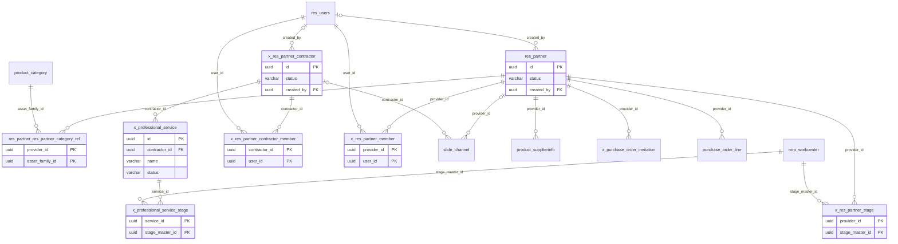

## Inventario

5 tablas · 16 relaciones que las tocan. Las entidades sin columnas pertenecen a otro grupo.

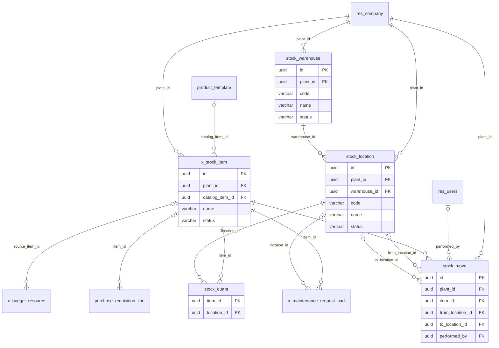

## Mantenimiento

5 tablas · 19 relaciones que las tocan. Las entidades sin columnas pertenecen a otro grupo.

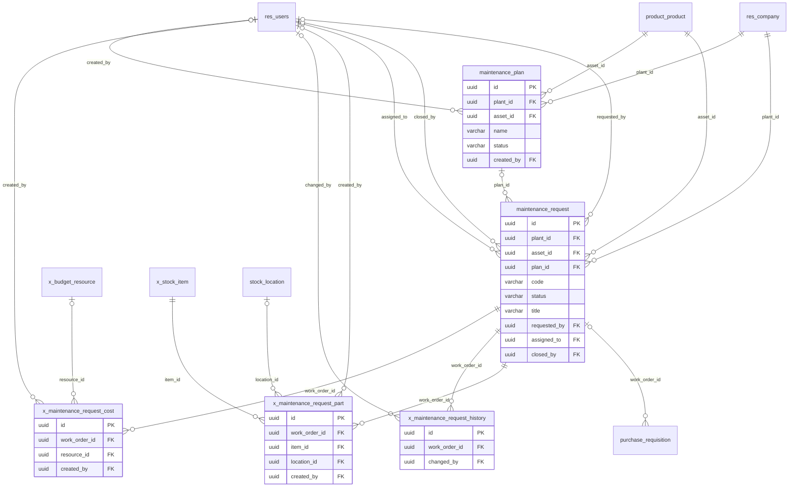

## Compras

6 tablas · 18 relaciones que las tocan. Las entidades sin columnas pertenecen a otro grupo.

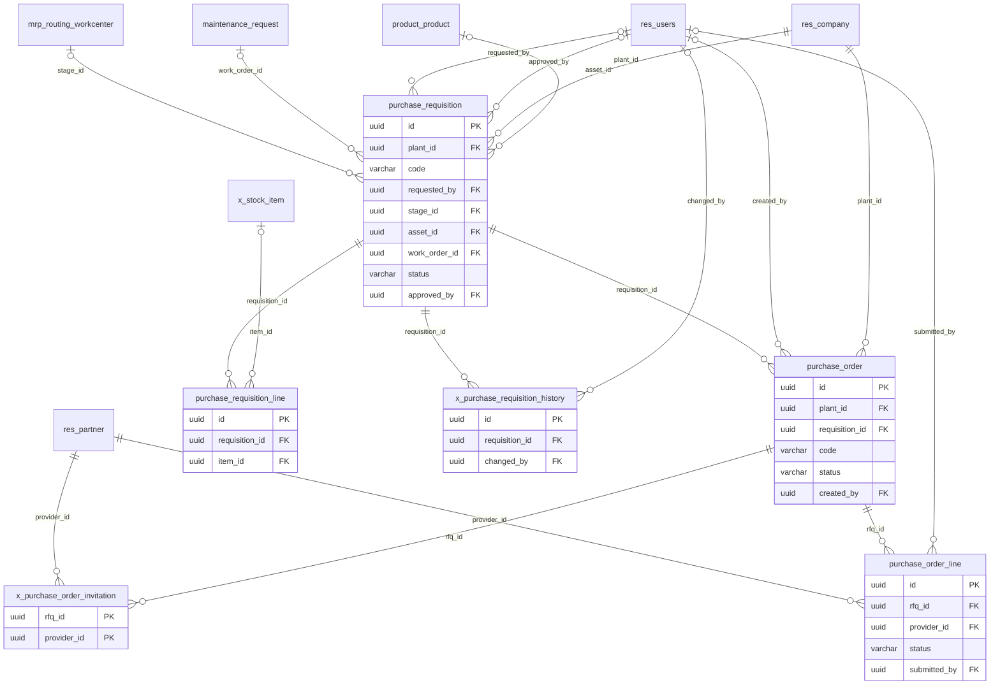

## Procesos de planta y redes

5 tablas · 17 relaciones que las tocan. Las entidades sin columnas pertenecen a otro grupo.

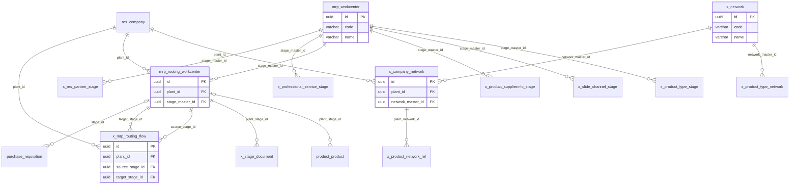

## Presupuestos y valorizaciones

12 tablas · 25 relaciones que las tocan. Las entidades sin columnas pertenecen a otro grupo.

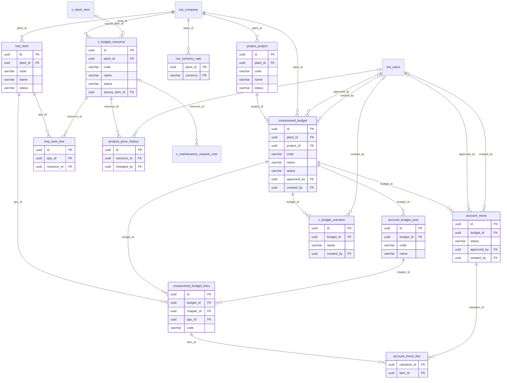

## Documentos

4 tablas · 8 relaciones que las tocan. Las entidades sin columnas pertenecen a otro grupo.

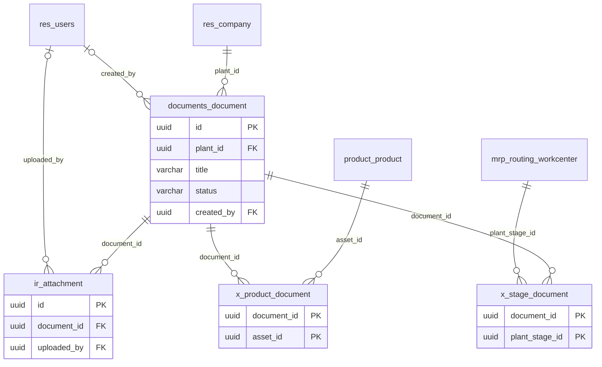

## Capacitación (eLearning)

5 tablas · 11 relaciones que las tocan. Las entidades sin columnas pertenecen a otro grupo.

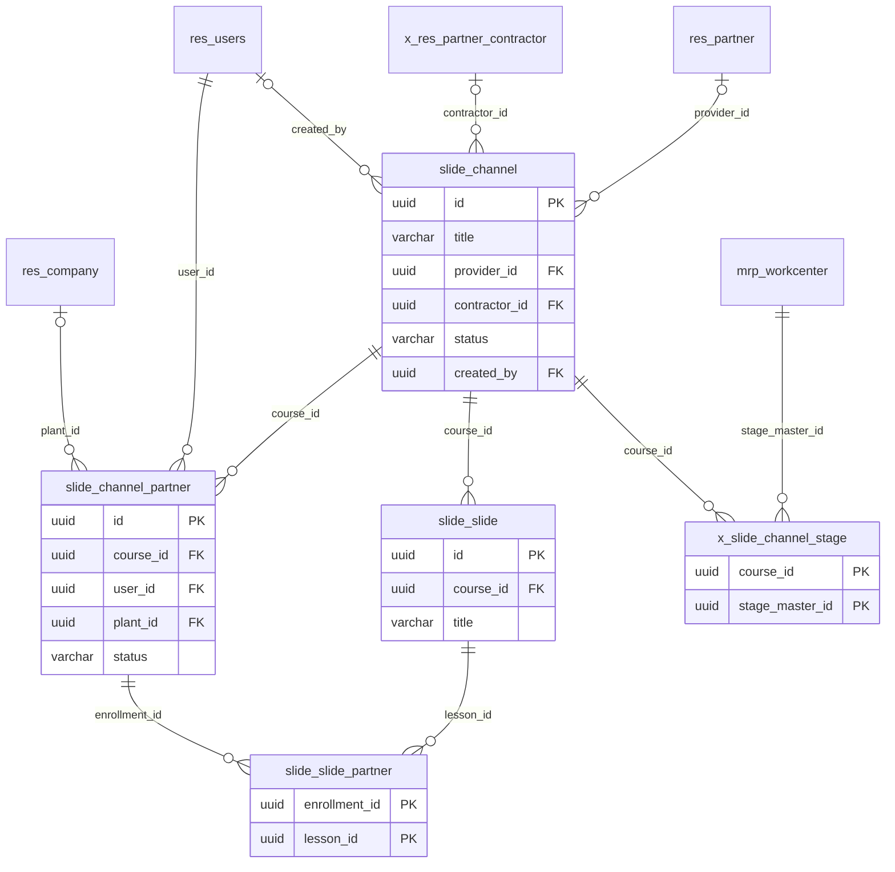
